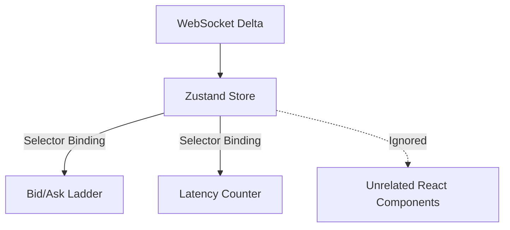

# Quantitative Trading Cockpit (React + TS)

A high-performance, real-time React dashboard for monitoring algorithmic crypto and prediction market trades. 
Built with Next.js, TypeScript, Zustand (for atomic state management), and Framer Motion for 60fps order-book delta animations.

### Features
- **Zero-Latency WebSockets:** Custom React hooks (`useOrderBook`) bound to streaming L2 deltas.
- **Atomic State:** Avoids React context re-render thrashing on fast market moves by using Zustand slices.
- **Risk Authority UI:** Real-time visualization of the Python `trade-risk-engine` telemetry.

## State Architecture

The frontend leverages `Zustand` to manage real-time L2 orderbook deltas without choking the React execution thread.

